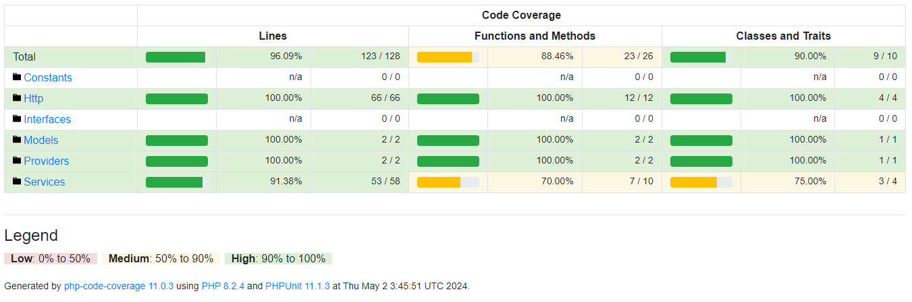

# Sistemas de pagamentos simplificado

Um sistema de pagamento simplificado que permite adicionar usuários comuns e lojistas e realizar transferências. Usuários comuns podem enviar dinheiro para lojistas e entre si. Lojistas apenas recebem transferências. *(criado para um teste)*

## Pré-requisitos

Antes de começar, certifique-se de que seu ambiente de desenvolvimento atende aos seguintes requisitos:

- [PHP](https://www.php.net/downloads.php) >= 8.2
- [Composer](https://getcomposer.org/)
- [Docker](https://www.docker.com/get-started/) (opcional)

## Instalação e Configuração

Clone o projeto:
```bash
git clone https://github.com/katson1/sistema-de-pagamentos.git
```

Acesse a pasta do projeto e instale as dependências necessárias com o composer:
```bash
cd sistema-de-pagamentos
composer install
```

Este projeto oferece duas opções para configurar seu ambiente de desenvolvimento: usando SQLite com PHP diretamente ou usando Docker. Siga os passos abaixo de acordo com a sua preferência de ambiente.

### Configuração com SQLite

Para configurar e iniciar o projeto usando SQLite, execute o seguintes comando:
``` bash
composer setup-sqlite
```
<blockquote> 
<details>
  <summary> O que esse script faz? </summary>
   
    Copia o arquivo .env.example para .env, configurando as variáveis de ambiente padrão.
    Gera uma chave de aplicativo única usando php artisan key:generate.
    Verifica se o arquivo database/database.sqlite existe, e cria um se não existir.
    Executa as migrações do banco de dados com php artisan migrate.
    Inicia o servidor de desenvolvimento local com php artisan serve.
</details>
</blockquote>


### Configuração com Docker
Para configurar e iniciar o projeto utilizando o Docker, execute o comando a seguir. Este processo pode levar algum tempo, pois será necessário baixar as imagens do Docker.
```bash
composer setup-docker
```
<blockquote> 
<details>
  <summary> O que esse script faz? </summary>
   
    Copia o arquivo .env.example.docker para .env, configurando as variáveis de ambiente para uso com Docker.
    Constrói e inicia os contêineres Docker com docker-compose up --build -d.
    Gera uma chave de aplicativo única usando php artisan key:generate.
    Executa as migrações do banco de dados dentro do contêiner app com docker-compose exec app php artisan migrate.
</details>
</blockquote>

## Como Usar
### Acessando a Documentação da API

Após iniciar a aplicação, você pode acessar a documentação interativa da API, que é fornecida pelo Swagger. Esta documentação oferece uma visão detalhada de todos os endpoints disponíveis, seus parâmetros, e as respostas esperadas para cada operação. Siga os passos abaixo para acessar a documentação:

1. **Iniciar a Aplicação**: Certifique-se de que a aplicação está rodando. Se você está usando Docker, a aplicação deve estar acessível após os passos de configuração mencionados anteriormente. Para usuários do SQLite, certifique-se de que o comando `php artisan serve` foi executado com sucesso.

2. **Acessar a Documentação**: Abra um navegador de sua preferência e visite o seguinte endereço:
   - Para **Docker**: [http://localhost:8989/api/documentation/](http://localhost:8989/api/documentation/)
   - Para **SQLite**: [http://localhost:8000/api/documentation/](http://localhost:8000/api/documentation/)

## Testes
Os testes utilizam o SQLite com a base na memória (:memory:) já que a tabela de banco é simples, facilitando também os testes pelo github.

Use o seguinte comando para executar os testes automatizados localmente (unitários e de integração):
```bash
php artisan test
```
Ou no docker:
```bash
docker-compose exec app php artisan test
```
Cobertura de testes, gerado com php-code-coverage:

## Autor
<div align="left">
  <div>
    Katson Matheus
    <a href="https://github.com/katson1">
      
    </a>
    <a href="https://discordapp.com/users/210789016675549184">
      
    </a>
    <a href="mailto:katson.alves@ccc.ufcg.edu.br">
      
    </a>
  </div>
</div>
